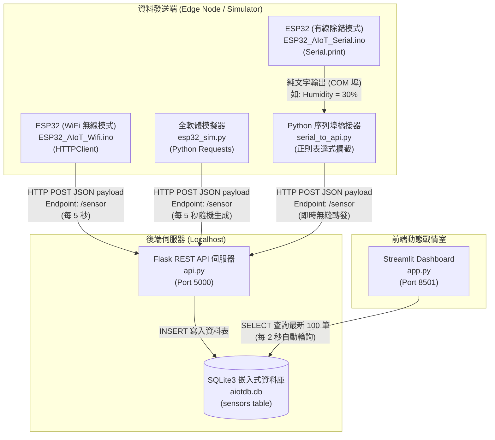
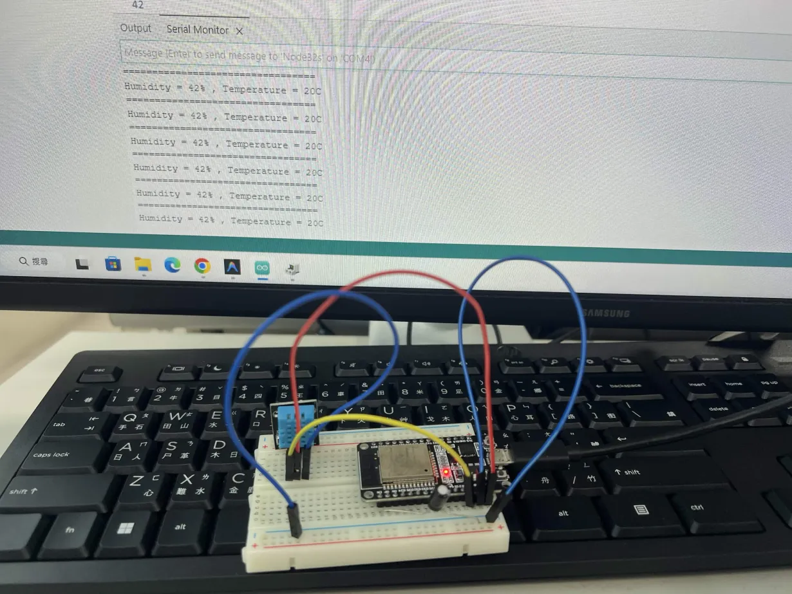
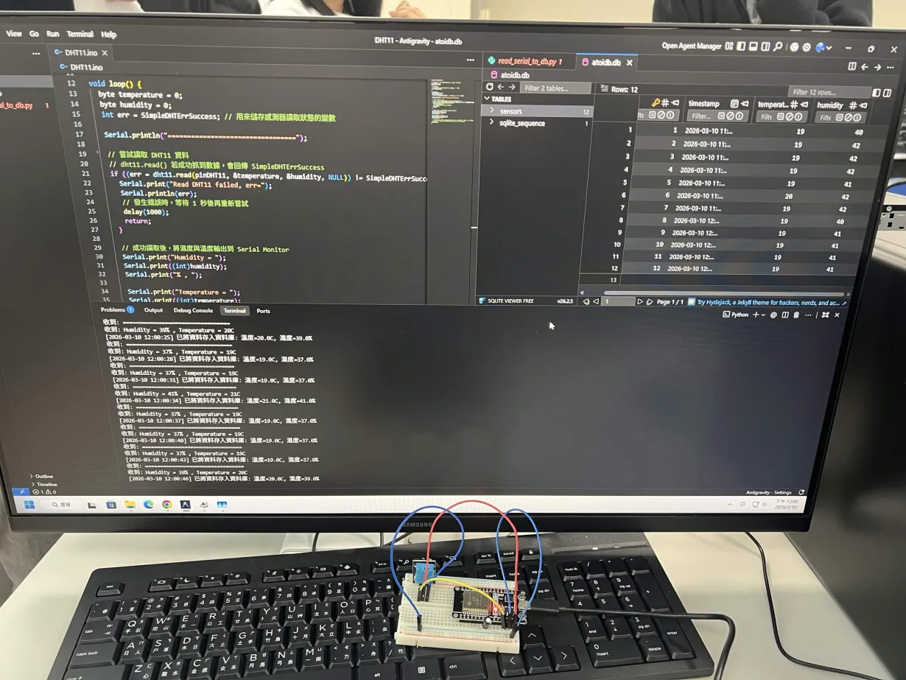
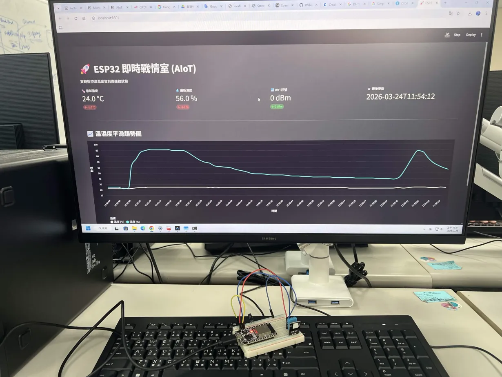
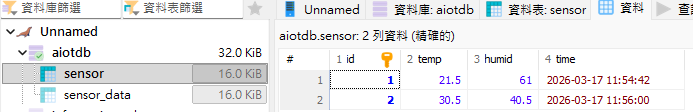

# AIoT 系統建置與實作：基於 ESP32 與 Python 全端架構的溫濕度即時戰情室
**(Project AIoT-HW1-DHT11 完整結案報告)**

---

## 📅 專案基本資訊
- **開發日期:** 2026-03
- **開發者:** Williecraft
- **專案目錄:** `e:\Williecraft\Desktop\Python\AIoT-HW1-DHT11`
- **核心技術堆疊:** 
  - **邊緣設備 (Edge Device):** ESP32 (C++) / DHT11 Temperature & Humidity Sensor
  - **後端 API 伺服器 (Backend):** Python 3 / Flask (RESTful POST API)
  - **持久化儲存 (Database):** SQLite3 (Embedded Database)
  - **資料視覺化儀表板 (Frontend):** Python 3 / Streamlit / Altair
  - **軟體資料生成器 (Simulator):** Python 3 (Random Generation)

---

## 🔗 第一章：專案資源與線上展示連結
本專案的完整原始碼已開源託管於 GitHub，可透過以下連結檢視完整程式碼與歷史提交紀錄：
1. **GitHub Repository:** [Williecraft/AIoT-HW1-DHT11](https://github.com/Williecraft/AIoT-HW1-DHT11)
2. **本機端即時展示 (Local Live Demo):** 
   - 儀表板入口: `http://localhost:8501` (需於本地端啟動 Streamlit 伺服器)
   - API 健康狀態端點: `http://localhost:5000/health`
   - *備註：若有後續部署至 Streamlit Cloud 或 Vercel 等公有雲服務，可直接替換為外網公開網址即可供全球瀏覽。*

---

## 🏗️ 第二章：系統架構設計動機與概觀 (Architecture Overview)

本專案的目標是打造一個**高質感、輕量級、離線可用且佈署成本極低**的端到端物聯網 (End-to-End AIoT) 數據收集與可視化系統。我們屏除了傳統 IoT 常用的重量級組件（如 MQTT Broker + Node-RED + InfluxDB + Grafana 的龐大體系），轉而採用純 Python 的生態系，讓開發者僅需安裝幾個 pip 套件，便能在一秒鐘內於自己的筆電上啟動一套企業級視覺享受的戰情室。

為了涵蓋極端開發與佈署環境，硬體端 (ESP32) 提供了三種資料拋轉策略：「WiFi 網路模式」、「有線 Serial 實體傳輸模式」，以及在硬體遺失或未接上時的「純軟體模擬器測試方案」。所有資料最終皆標準化為 JSON 格式，匯集至 Flask API 並存入 SQLite，最後由 Streamlit 進行高頻圖表渲染。

---

## 📡 第三章：硬體感測端與三軌資料獲取策略 (Data Acquisition)

現實場域的網路環境往往難以預測，因此我們為資料發送端設計了「WiFi 無線」、「USB 有線降級」與「純軟體模擬」三種軌道，確保系統在任何情況下皆能進行展示與測試。

### 1. 軟體模擬器 (`esp32_sim.py`) —— 開發初期的神兵利器
在硬體尚未接線或沒有 ESP32 開發板的情況下，如何繼續開發前端儀表板？我們撰寫了官方模擬器：
- **作法**：使用 Python 內建的 `random` 模組，每 5 秒隨機產生範圍在 $20.0 \sim 35.0^\circ\text{C}$ 的溫度、與 $45.0 \sim 75.0\%$ 的濕度，以及動態浮動的網路訊號強度 (RSSI)。
- **效益**：開發者能專注於 API 負載測試與前端圖表的動態渲染微調，不必等待真實硬體緩慢的採樣。

### 2. 真實 IoT 場景：有 WiFi 網路模式 (`ESP32_AIoT_Wifi.ino`)
在這個模式下，ESP32 將真正成為邊緣運算節點 (Edge Node)：
- **感測層**：透過 `SimpleDHT` 函式庫與實體 DHT11 模組溝通，獲得精確的溫濕度數值。
- **網路層**：使用 `<WiFi.h>` 模組連線至區網，建立 `HTTPClient` 以發起 HTTP POST 請求。
- **資料封裝**：手動組裝成嚴謹的 JSON 字串，例如 `{"device_id": "ESP32-NODE-1", "temperature": 25.5, ...}`，並連帶回傳目前的 WiFi RSSI 以監控裝置網路健康度。

### 3. 無 WiFi 退避機制：有線橋接模式 (`ESP32_AIoT_Serial.ino` + `serial_to_api.py`)
若展示現場缺乏 WiFi 路由器，系統可降級為純有線資料打點模式：
- **硬體退避行為**：ESP32 僅單純透過 `Serial.print` 往 COM 埠吐出舊版的純文字資訊 (如 `Humidity = 30% , Temperature = 23C`)。
- **Python 橋接器攔截 (`serial_to_api.py`)**：電腦端運行一支爬蟲程式，監聽目標 COM 埠，利用**正規表達式 (Regex)** 取出數字，並強制將 `wifi_rssi` 設為 0 以標記 `OFFLINE_SERIAL` 狀態，隨後由橋接器代發 POST 給 Flask 伺服器。
- **防鎖死核心技術**：特別在連線參數中加入了 `ser.setDTR(False)` 與 `ser.setRTS(False)`。若沒有這兩行，只要 Python 程式一執行，因為硬體設計缺陷，將觸發 ESP32 的 EN 腳位導致全版重啟鎖死，這是一項極度重要的系統穩定層級補釘。

**【有線橋接模式實作照片】**

*▲ 圖 3-1：左側為程式碼片段，下方 ESP32 的 Serial Monitor 成功透過實體傳輸線，每隔幾秒吐出純文字的真實溫濕度與延遲數據。*

*▲ 圖 3-2：電腦端 Python 橋接器 (`serial_to_api.py`) 成功接管 Serial Port 資訊，利用正則攔截數值後，無縫轉換成 JSON 並轉發至 SQLite 資料庫，實現離線打點！*

---

## 🗄️ 第四章：後端伺服器與資料庫設計 (Backend & Database)

為了追求極簡化佈署，專案捨棄了常見的關聯式資料庫伺服器群系統 (如 MySQL / PostgreSQL)，轉型為 Flask + SQLite 的高內聚力系統。

### 1. RESTful API 端點 (`api.py`)
利用 Flask 的輕量特性，本專案實作了兩個標準化端點：
- `GET /health`：Liveness 探針，回傳 `{"status": "healthy"}`，供除錯腳本檢查 API 是否順利存活於背景中。
- `POST /sensor`：核心資料入口。其會解析 JSON，若缺少時間戳，則會由伺服器使用 `datetime.now().isoformat()` 進行自動標記，隨後寫入 DB。

### 2. 嵌入式資料庫 (`aiotdb.db`) 與熱重啟機制
- **具象化 Schema**：資料表 `sensors` 結構包含了 `id` (主鍵)、`device_id`、`wifi_ssid`、`wifi_rssi`、`temperature`、`humidity` 以及 `timestamp`。
- **動態熱重啟 (`DROP TABLE IF EXISTS`)**：在每次啟動 Flask API 時，`init_db()` 皆會主動摧毀並重建表格。這樣設計的考量點在於：**讓每次系統演示 (Demo) 都能從完全乾淨的圖表開始**。觀者可以享受曲線從無到有，資料慢慢填滿儀表板的視覺愉悅感，避免累積髒資料導致初次渲染過於擁擠。

---

## 📊 第五章：前端可視化即時戰情室 (Frontend Dashboard)

舊版的網頁系統經常面臨「缺乏動態更新」或「只能每秒按 F5 重新整理整個頁面以獲取新圖表」的窘境。引進 **Streamlit** 後，本專案在前端視覺化完成了跨時代的升級 (`app.py`)。

### 1. 沉浸式動態使用者介面 (UI/UX)
- **客製化漸層動態背景**：為了突破儀表板的死板感，寫入了 `@keyframes gradientBG` 動畫 CSS，將背景渲染成如極光般緩慢變化的漸層色彩。
- **專屬高級調色盤**：嚴格統一了介面的色系為五種莫蘭迪深色調 `["#474448", "#2d232e", "#e0ddcf", "#534b52", "#f1f0ea"]`。

### 2. 即時效能指標 (Real-time KPIs)
畫面上方永遠置頂 4 塊動態指標卡 (Metric Cards)，運用 Streamlit 的差值計算 (`delta`) 功能，自動與上一筆資料比對。如果溫度相較上一秒上升，便呈示綠色增加箭頭；如果 WiFi 訊號衰退，則顯示紅色減少箭頭，一目了然。

### 3. 高階 Altair 互動式平滑趨勢圖 (Interactive Chart)
摒棄傳統剛硬折線圖：
- **連續平滑線條**：利用 `mark_line(interpolate='monotone', strokeWidth=3)` 對離散資料進行曲線擬合，讓溫濕度趨勢如水波般柔順。
- **Y 軸智慧動態延伸**：為避免折線直接撞到上下邊界，系統加入了 `padding = (max_val - min_val) * 0.2` 的動態留白緩衝演算法，始終保持畫面張力。
- **互動 Hover 追蹤**：使用 `alt.selection_point()` 搭配垂直基準虛線。滑鼠移到哪，該時間點的精準標籤就會浮現。

**【即時戰情室實際運行畫面】**

*▲ 圖 5-1：實體 ESP32 裝置接電後持續發送資料，並引發本機端 Streamlit 全屏動態戰情室的高頻即時連動渲染展示。畫面上不僅有 KPI 面板，下方的平滑雙色線也正平穩推進。*

---

## ⚡ 第六章：一鍵自動化部署機制 (Automation Script)

若一項工具啟動流於繁瑣，將大幅度阻礙推廣。為了不讓使用者頻繁輸入指令，專案開發了整合性腳本 **`start_all.bat`**。
- **並行啟動**：利用 `start "" cmd.exe /k` 指令，一次雙擊即可同時拉起 API 面板、儀表板頁面與 Serial 橋接器，各司其職。
- **解決中文字元破壞系統的技術債**：Windows PowerShell/CMD 經常因為輸出 Emoji (如 🚀) 與中文字而引發 Crash。腳本內強制設定了 `set PYTHONIOENCODING=utf-8` 以及關閉輸出快取的 `set PYTHONUNBUFFERED=1`，確保所有的即時打點文字都能流暢無礙地捲動。

---

## 🏛️ 第七章：舊版架構回顧與跨時代重構 (Legacy Architecture Review)

在演進為現行版本前，本專案是以完全不同技術栈構建而成的，這些富有歷史意義的程式碼目前全數封存於 `old/` 目錄中以供備查。

### 1. 依賴 MySQL 與 HTTP GET 的舊體系
早期的硬體 (`DHT11.ino`) 與伺服器強烈依賴 Apache 或 XAMPP 面板：
- 資料傳輸是極度暴力的 **HTTP GET**，將數值赤裸裸地掛在 URL 末端 (如：`?temp=23.5&humid=50`)。
- 為了確保安全性，需在 PHP (`addData.php`) 中手動使用 `floatval()` 過濾。

### 2. 中期的 Flask 過渡版本
後來嘗試了 Flask `addData.py` 開發，雖然導入了參數化查詢 (`%s`) 並回傳了標準 JSON，但仍使用 URL 路由傳送 (`/aiot/{溫度}/{濕度}`) 以及體積龐大的 MySQL 資料庫。

### 3. 放棄的主因
舊版雖支援了 PHP 與 Python 的雙棲並行，但「環境建置成本過高」(要安裝關聯式資料庫)、「安全性低落」(不合規的 RESTful HTTP 動詞)，最終促成了全面向「SQLite + Flask POST payload」現代化輕量架構的過渡。

**【舊版開發截圖巡禮】**

*▲ 圖 7-1：舊版 PHP `addData.php` 將 GET 參數解析後成功寫入的純白畫面回傳結果。*
   

*▲ 圖 7-2：舊版 Flask API `addData.py` 的介面，當時仍採用 URL 路徑傳遞資料。*

*▲ 圖 7-3：早期於 MySQL 或 MariaDB 建立的資料庫 `sensor` 資料表紀錄。*

---

## 📝 第八章：開發日誌與技術難點克服 (Development Log)

*(本章節摘錄整理自原使碼堆疊與 `log.md` 專案演進日誌)*

1. **從無到有建立全棧 (Full-stack) 系統**：由 Prompts 的輔助快速完成了系統的底層骨架，確認資料能在不同 port 之間流竄無礙。
2. **擺脫虛擬環境綁架**：為了保持隨插即用，全面修改了相依庫載入邏輯，不再依賴繁瑣的 `venv`，降落至 Global Python 系統。
3. **終極視覺打磨**：
   - 解決 Altair 繪圖在無資料時造成的 Exception Crash（透過 `if not df.empty` 防呆）。
   - 修復了折線圖上干擾視覺的白點，將其改為全平滑的流線形渲染，並將擠在右側的圖例往下移，保持圖表橫向伸展性最大化。
4. **設備極限相容**：即使使用者拿了沒有正確燒錄 WiFi 邏輯的開發板，專案中的 `serial_to_api.py` 也展現了極好的包容度，用正則表達式硬生生地在純文字串中「挖出」溫濕度資料並送入資料庫。
5. **最終成果**：一套具有高度容錯力、精美儀表板、完善操作手冊，並以標準化文檔紀錄完整演進歷程的卓越物聯網結案作品。

### ➡️ 啟動測試您的專屬戰情室吧！
只需在終端機內打入 `start_all.bat`，然後將 ESP32 插入電源，一場結合硬體與軟體藝術的數據實境秀，就會在您的瀏覽器上絢麗展開！
