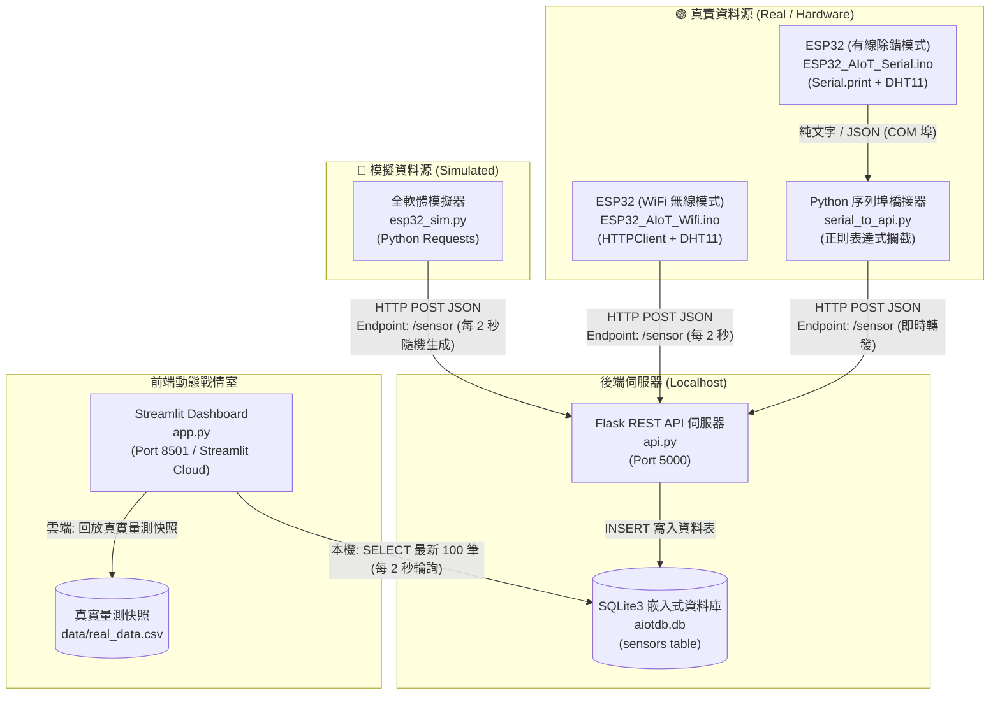
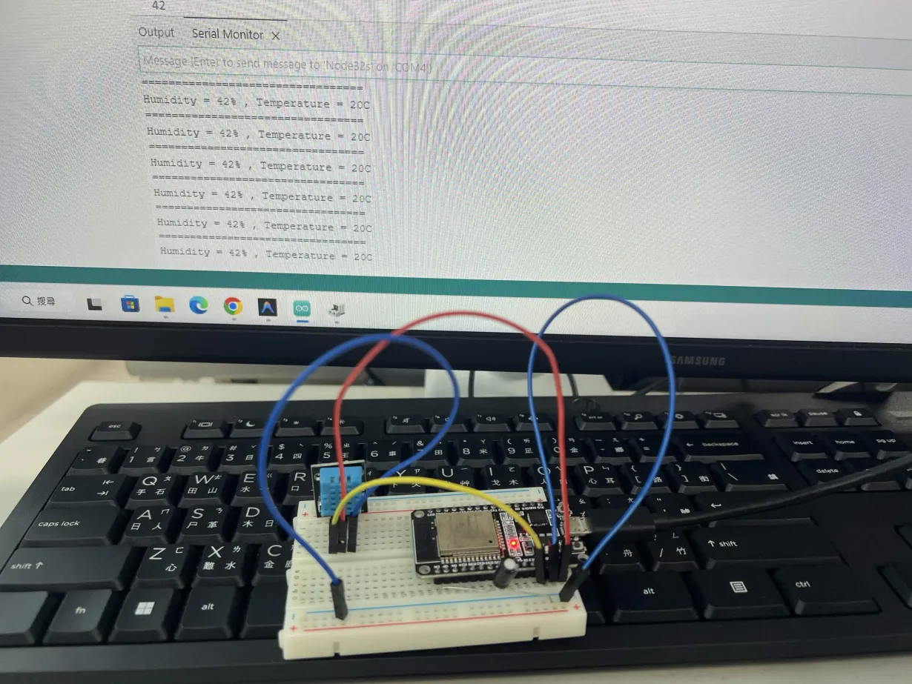
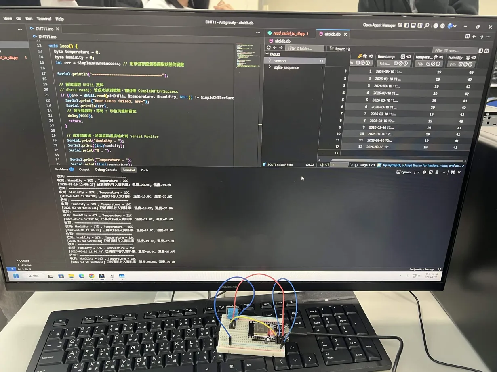
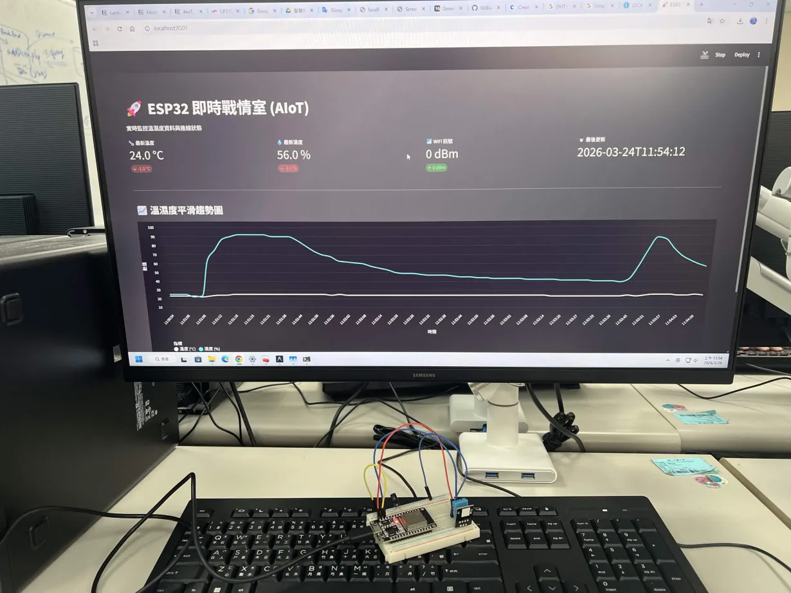
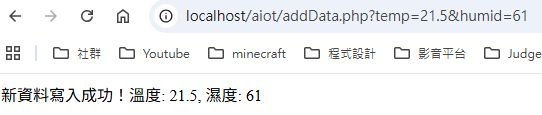
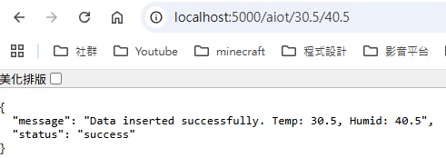
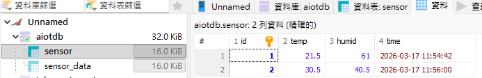

# AIoT 系統建置與實作：基於 ESP32 與 Python 全端架構的溫濕度即時戰情室
**（Project AIoT-HW1-DHT11 完整結案報告）**

> **HW1 — AIoT System** | 同時涵蓋「**真實硬體量測**」與「**軟體模擬**」雙軌資料源，並提供 GitHub 原始碼、Streamlit Cloud 線上 Live Demo 與完整開發日誌。

---

## 📑 摘要與作業需求對照表 (Requirement Mapping)

| 作業要求 | 本專案對應實作 | 位置 / 連結 |
| --- | --- | --- |
| **① 真實 (Real) 資料源** | ESP32 + 實體 DHT11 感測器，經 WiFi / 有線兩種途徑回傳真實溫濕度，量測資料封存於 `aiotdb.db` 與 `data/real_data.csv` | 第三章、第四章 |
| **① 模擬 (Simulated) 資料源** | 純 Python 軟體模擬器 `esp32_sim.py`，無硬體即可壓力測試後端與前端 | 第三章 §1 |
| **② GitHub** | 完整原始碼、提交歷史與文件開源託管 | [Williecraft/AIoT-HW1-DHT11](https://github.com/Williecraft/AIoT-HW1-DHT11) |
| **② Live Demo (Streamlit Cloud)** | 儀表板已改為雲端可獨立運行，回放真實量測快照 | 第一章 §2 |
| **③ Development Log** | 兩份開發日誌：`log.md`（演進摘要）、`chat.md`（與 AI 協作對話全紀錄） | 第八章 |

> 本系統刻意設計為「真實」與「模擬」**共用同一條後端管線**（同一組 Flask API、同一張 SQLite 資料表、同一個 Streamlit 儀表板），因此無論資料來自實體 ESP32 或軟體模擬器，皆能無縫切換、即時呈現，完整滿足 HW1 對「真實 + 模擬」雙部分的要求。

---

## 📅 專案基本資訊
- **開發日期：** 2026-03 ～ 2026-06
- **開發者：** Williecraft
- **專案目錄：** `d:\Williecraft\Desktop\Python\AIoT-HW1-DHT11`
- **核心技術堆疊：**
  - **邊緣設備 (Edge Device)：** ESP32 (C++) / DHT11 溫濕度感測器
  - **後端 API 伺服器 (Backend)：** Python 3 / Flask (RESTful POST API)
  - **持久化儲存 (Database)：** SQLite3 (嵌入式資料庫)
  - **資料視覺化儀表板 (Frontend)：** Python 3 / Streamlit / Altair
  - **軟體資料生成器 (Simulator)：** Python 3 (Random Generation)
  - **線上部署 (Deployment)：** Streamlit Community Cloud

---

## 🔗 第一章：專案資源與線上展示連結

### 1. GitHub 原始碼倉庫
本專案完整原始碼已開源託管於 GitHub，可檢視完整程式碼與歷史提交紀錄：
- **GitHub Repository：** [https://github.com/Williecraft/AIoT-HW1-DHT11](https://github.com/Williecraft/AIoT-HW1-DHT11)

### 2. Live Demo（線上即時展示）
儀表板已重構為**雲端可獨立運行**版本，部署於 Streamlit Community Cloud，無需任何本機環境即可在瀏覽器中觀看即時流動的溫濕度戰情室：
- **線上儀表板：** `https://aiot-hw1-dht11.streamlit.app`
  *（部署來源：本倉庫 `app.py`；首次喚醒約需 20~30 秒）*

> **雲端如何「即時」？** Streamlit Cloud 上沒有實體 ESP32，因此 `app.py` 內建**自動資料源切換**：偵測不到本機 Flask API 寫入時，會自動回放封存於 `data/real_data.csv` 的**真實量測快照**，以滑動視窗逐筆推進，讓線上 Demo 的曲線持續流動，完整重現實機跑動時的視覺效果。

### 3. 本機端即時展示 (Local Live Demo)
- 儀表板入口：`http://localhost:8501`（本地端啟動 Streamlit 後）
- API 健康狀態端點：`http://localhost:5000/health`

---

## 🏗️ 第二章：系統架構設計動機與概觀 (Architecture Overview)

本專案目標是打造一個**高質感、輕量級、離線可用且部署成本極低**的端到端物聯網 (End-to-End AIoT) 數據收集與可視化系統。我們屏除了傳統 IoT 常用的重量級組件（如 MQTT Broker + Node-RED + InfluxDB + Grafana 的龐大體系），轉而採用純 Python 生態系，讓開發者僅需 `pip install` 幾個套件，便能在數秒內於筆電上啟動一套企業級視覺享受的戰情室。

最重要的是，系統以**「真實」與「模擬」雙軌並行**為設計核心：硬體端 (ESP32) 提供「WiFi 無線模式」與「有線 Serial 實體傳輸模式」兩種真實量測途徑；軟體端則提供「純軟體模擬器」用於無硬體時的開發與壓測。三條軌道的資料最終皆**標準化為同一份 JSON 結構**，匯集至 Flask API 並存入 SQLite，最後由 Streamlit 進行高頻圖表渲染——這正是 HW1 要求的「真實 + 模擬」兩部分的最佳整合。

```mermaid
flowchart TD
    %% Hardware & Simulators
    subgraph Real ["🟢 真實資料源 (Real / Hardware)"]
        direction TB
        A1["ESP32 (WiFi 無線模式)\nESP32_AIoT_Wifi.ino\n(HTTPClient + DHT11)"]
        A2["ESP32 (有線除錯模式)\nESP32_AIoT_Serial.ino\n(Serial.print + DHT11)"]
        Bridge["Python 序列埠橋接器\nserial_to_api.py\n(正則表達式攔截)"]
    end

    subgraph Sim ["🔵 模擬資料源 (Simulated)"]
        direction TB
        A3["全軟體模擬器\nesp32_sim.py\n(Python Requests)"]
    end

    %% Backend
    subgraph Backend ["後端伺服器 (Localhost)"]
        direction TB
        B["Flask REST API 伺服器\napi.py\n(Port 5000)"]
        C[("SQLite3 嵌入式資料庫\naiotdb.db\n(sensors table)")]
    end

    %% Frontend
    subgraph Frontend ["前端動態戰情室"]
        direction TB
        D["Streamlit Dashboard\napp.py\n(Port 8501 / Streamlit Cloud)"]
        E[("真實量測快照\ndata/real_data.csv")]
    end

    %% Routing
    A1 -- "HTTP POST JSON\nEndpoint: /sensor (每 2 秒)" --> B
    A3 -- "HTTP POST JSON\nEndpoint: /sensor (每 2 秒隨機生成)" --> B
    A2 -- "純文字 / JSON (COM 埠)" --> Bridge
    Bridge -- "HTTP POST JSON\nEndpoint: /sensor (即時轉發)" --> B

    B -- "INSERT 寫入資料表" --> C
    D -- "本機: SELECT 最新 100 筆 (每 2 秒輪詢)" --> C
    D -- "雲端: 回放真實量測快照" --> E
```

---

## 📡 第三章：資料獲取——「真實」與「模擬」雙軌策略 (Data Acquisition)

本章是 HW1 的核心：系統同時具備**真實硬體量測**與**軟體模擬**兩條獨立資料軌道，並可隨時無縫切換。

### 1. 🔵 模擬資料源：軟體模擬器 (`esp32_sim.py`)
在硬體尚未接線、或需要對後端與前端進行壓力測試時，模擬器扮演關鍵角色：
- **作法**：使用 Python 內建 `random` 模組，每 2 秒產生範圍在 $20.0 \sim 30.0^\circ\text{C}$ 的溫度、$40.0 \sim 60.0\%$ 的濕度，以及動態浮動 ($-85 \sim -40$ dBm) 的網路訊號強度 (RSSI)，組成與真實硬體**完全一致的 JSON 結構**送往 `/sensor`。
- **效益**：開發者能專注於 API 負載測試與前端圖表動態渲染的微調，不必等待真實硬體緩慢採樣。
- **精準計時**：採 `time.monotonic()` 累加 `next_tick`，避免一般 `sleep` 累積飄移，確保穩定的 2 秒節拍。

### 2. 🟢 真實資料源 A：WiFi 無線模式 (`ESP32_AIoT_Wifi.ino`)
此模式下 ESP32 成為真正的邊緣運算節點 (Edge Node)：
- **感測層**：透過 `SimpleDHT` 函式庫與實體 DHT11 模組溝通（資料線接 GPIO 13），取得真實溫濕度數值。
- **網路層**：以 `<WiFi.h>` 連線至區網，建立 `HTTPClient` 發起 HTTP POST 請求。
- **資料封裝**：組裝為嚴謹 JSON，例如 `{"device_id":"esp32_real_01", "wifi_ssid":"...", "wifi_rssi":-50, "temperature":25, "humidity":60}`，並連帶回傳真實的 WiFi RSSI 以監控裝置網路健康度。
- **回應驗證**：Serial Monitor 會印出 `HTTP Response code: 201` 表示後端成功建立紀錄。

> 📌 **真實量測資料說明**：本次實機運行所採集到的真實溫濕度紀錄，已封存於專案資料庫 `aiotdb.db`（`device_id = esp32_real_01`，WiFi SSID = `IoT_Net_2.4G`），並另匯出精簡快照 `data/real_data.csv` 供雲端 Live Demo 回放。報告中的所有圖表與數據皆以此真實量測資料為準。

### 3. 🟢 真實資料源 B：無 WiFi 退避——有線橋接模式 (`ESP32_AIoT_Serial.ino` + `serial_to_api.py`)
若展示現場缺乏 WiFi 路由器，系統可降級為純有線資料打點模式：
- **硬體端行為**：ESP32 透過 `Serial.print` 往 COM 埠吐出與 WiFi 版一致的 JSON（`wifi_ssid` 標記為 `OFFLINE_SERIAL`、`wifi_rssi` 設為 0 以利在儀表板上區分來源）。
- **Python 橋接器攔截 (`serial_to_api.py`)**：電腦端監聽目標 COM 埠，**雙模式相容解析**——
  - 情境一：標準 JSON 字串，直接 `json.loads()` 轉發。
  - 情境二：舊版純文字（如 `Humidity = 30% , Temperature = 23C`），以**正規表達式 (Regex)** 萃取數值後封裝為相容 JSON。
- **🔑 防鎖死核心技術**：連線參數加入 `ser.setDTR(False)` 與 `ser.setRTS(False)`。若缺此兩行，Python 一連線即會誤觸 ESP32 的 EN/BOOT (Reset) 腳位導致全板重啟鎖死——這是一項極關鍵的穩定性補釘。

**【有線橋接模式實機照片】**

*▲ 圖 3-1：實體 ESP32 的 Serial Monitor 透過實體傳輸線，每隔數秒吐出真實溫濕度與延遲數據。*

*▲ 圖 3-2：電腦端 Python 橋接器 (`serial_to_api.py`) 接管 Serial Port，以正則攔截數值後無縫轉成 JSON 並寫入 SQLite，實現離線打點。*

---

## 🗄️ 第四章：後端伺服器與資料庫設計 (Backend & Database)

為追求極簡部署，專案捨棄關聯式資料庫伺服器（如 MySQL / PostgreSQL），改採 Flask + SQLite 的高內聚架構。

### 1. RESTful API 端點 (`api.py`)
以 Flask 輕量特性實作兩個標準化端點：
- `GET /health`：Liveness 探針，回傳 `{"status": "healthy"}`，供除錯腳本檢查 API 是否存活。
- `POST /sensor`：核心資料入口，解析 JSON 並以**參數化查詢 (`?` 佔位符)** 寫入資料庫以防範 SQL Injection；若缺少時間戳，則由伺服器以 `datetime.now().isoformat()` 自動標記，成功回傳 HTTP 201。

### 2. 嵌入式資料庫 (`aiotdb.db`) 與熱重啟機制
- **資料表 Schema**：`sensors` 表含 `id`(主鍵)、`device_id`、`wifi_ssid`、`wifi_rssi`、`temperature`、`humidity`、`timestamp`。
- **真實 / 模擬共表**：真實硬體 (`esp32_real_01`)、有線降級 (`OFFLINE_SERIAL`)、軟體模擬 (`esp32_01`) 三種來源寫入**同一張表**，僅由 `device_id` / `wifi_ssid` 區分，達成單一管線、多源相容。
- **動態熱重啟 (`DROP TABLE IF EXISTS`)**：每次啟動 Flask API 時，`init_db()` 主動重建表格，讓每次 Demo 都從乾淨圖表開始，觀者可享受曲線從無到有逐漸填滿的視覺愉悅。

---

## 📊 第五章：前端可視化即時戰情室 (Frontend Dashboard)

引進 **Streamlit + Altair** 後，前端視覺化完成跨時代升級 (`app.py`)，並支援**本機即時連線**與**雲端快照回放**雙模式自動切換。

### 1. 沉浸式動態使用者介面 (UI/UX)
- **客製化漸層動態背景**：以 `@keyframes gradientBG` CSS 動畫，將背景渲染成如極光般緩慢變化的莫蘭迪深色漸層。
- **專屬高級調色盤**：介面色系統一為五種莫蘭迪色調 `["#474448", "#2d232e", "#e0ddcf", "#534b52", "#f1f0ea"]`，並另透過 `.streamlit/config.toml` 統一元件主題。

### 2. 即時效能指標 (Real-time KPIs)
畫面頂部置頂 4 塊動態指標卡（溫度 / 濕度 / WiFi 訊號 / 最後更新），運用 Streamlit 的差值計算 (`delta`) 自動與上一筆比對：溫度上升顯示綠色增加箭頭、WiFi 訊號衰退則顯示紅色減少箭頭，狀態一目了然。

### 3. 高階 Altair 互動式平滑趨勢圖
- **連續平滑線條**：`mark_line(interpolate='monotone', strokeWidth=3)` 對離散資料曲線擬合，讓溫濕度趨勢如水波般柔順。
- **Y 軸智慧動態延伸**：加入 `padding = (max_val - min_val) * 0.2` 動態留白緩衝，使折線不貼齊上下邊界，始終保持畫面張力。
- **互動 Hover 追蹤**：以 `alt.selection_point()` 搭配垂直基準虛線，滑鼠移到哪，該時間點的精準溫濕度標籤即浮現。
- **雙色對比**：溫度為米白 `#f1f0ea`、濕度為淺藍 `#4DD0E1`，避免雙線同色難辨。

### 4. 雙模式資料源自動切換（雲端 Live Demo 關鍵）
`get_frame()` 會先嘗試讀取本機 SQLite 即時資料；若偵測不到（即雲端環境），自動回放 `data/real_data.csv` 真實量測快照，以 `st.session_state` 滑動視窗逐筆推進。**同一份 `app.py` 因此可同時服務本機即時連線與 Streamlit Cloud 線上展示**。

**【即時戰情室實際運行畫面】**

*▲ 圖 5-1：實體 ESP32 裝置接電後持續發送真實量測資料，引發本機 Streamlit 全屏動態戰情室的高頻即時連動渲染。上方為 KPI 面板，下方平滑雙色線正平穩推進。*

---

## ⚡ 第六章：一鍵自動化部署機制 (Automation Script)

為降低啟動門檻，專案提供整合腳本 **`start_all.bat`**：
- **並行啟動**：以 `start "" cmd.exe /k` 一次拉起 API 伺服器、Streamlit 儀表板與 Serial 橋接器，各司其職。
- **解決中文 / Emoji 編碼破壞**：腳本內強制 `set PYTHONIOENCODING=utf-8` 與 `set PYTHONUNBUFFERED=1`，避免 Windows CMD 預設 CP950 編碼遇到 Emoji（如 🚀）或中文崩潰，並確保即時日誌流暢捲動不被快取卡死。

---

## ☁️ 第七章：Streamlit Cloud 線上部署指南 (Deployment Guide)

本專案儀表板可零修改部署至 Streamlit Community Cloud，提供作業要求的公開 Live Demo：

1. 將整個專案 `git push` 至 GitHub（含 `app.py`、`data/real_data.csv`、`requirements.txt`、`.streamlit/config.toml`）。
2. 登入 [share.streamlit.io](https://share.streamlit.io)，點選 **New app**，選擇本倉庫與分支，主程式指定為 `app.py`。
3. 按下 **Deploy**，等待約 1 分鐘安裝依賴後，即可獲得公開網址（如 `https://aiot-hw1-dht11.streamlit.app`）。
4. 雲端因無實體硬體，`app.py` 自動進入**真實量測快照回放模式**，曲線持續流動，完美重現實機效果。

> 💡 `requirements.txt` 已列出 `streamlit / pandas / altair`，足以支撐雲端執行；`flask / requests / pyserial` 為本機真實/模擬資料管線所需，於雲端閒置不影響運行。

---

## 🏛️ 第八章：開發日誌與技術演進 (Development Log)

> 本專案提供**兩份**開發日誌，完整滿足 HW1「development log」要求：
> - **`log.md`**：專案演進摘要、架構變遷與優化重點。
> - **`chat.md`**：與 AI 協作的完整對話紀錄（Prompt → 產出 → 迭代）。

### 1. 開發里程碑摘要
1. **從無到有建立全棧系統**：確認資料能在不同 port 間流暢傳遞，打通 ESP32 → Flask → SQLite → Streamlit 全鏈路。
2. **擺脫虛擬環境綁架**：改用 Global Python，達成隨插即用。
3. **真實 + 模擬雙軌整合**：模擬器與實體硬體共用同一 JSON 結構與後端管線，無縫切換。
4. **終極視覺打磨**：解決 Altair 無資料時的 Exception（`if not df.empty` 防呆）、移除干擾白點、圖例置底、雙色對比優化、Y 軸智慧延展。
5. **設備極限相容**：`serial_to_api.py` 以正則表達式硬解析純文字測資，相容舊版燒錄邏輯。
6. **雲端化升級**：重構 `app.py` 為雙模式資料源，導入真實量測快照回放，達成 Streamlit Cloud 公開 Live Demo。

### 2. 舊版架構回顧 (Legacy Architecture, `old/`)
演進為現行版本前，專案曾以 MySQL + HTTP GET + PHP 構建，相關程式碼封存於 `old/` 目錄：
- 早期 `DHT11.ino` 以暴力 **HTTP GET** 將數值掛在 URL 末端（`?temp=23.5&humid=50`），由 PHP `addData.php` 以 `floatval()` 過濾。
- 中期 Flask `addData.py` 雖導入參數化查詢，但仍走 URL 路由 (`/aiot/{溫度}/{濕度}`) 與龐大 MySQL。
- 因「環境建置成本過高」與「不合規 RESTful 動詞」，最終全面轉向 **SQLite + Flask POST payload** 現代化輕量架構。

**【舊版開發截圖巡禮】**

*▲ 圖 8-1：舊版 PHP `addData.php` 解析 GET 參數後成功寫入的回傳結果。*

*▲ 圖 8-2：舊版 Flask `addData.py`，當時仍採 URL 路徑傳遞資料。*

*▲ 圖 8-3：早期於 MySQL / MariaDB 建立的 `sensor` 資料表紀錄。*

---

## ✅ 結語：一套真實與模擬兼備的卓越 AIoT 作品

本專案完整覆蓋 HW1 三大要求——**真實硬體量測 + 軟體模擬雙軌資料源**、**GitHub 開源倉庫**、**Streamlit Cloud 線上 Live Demo**，並附上 `log.md` 與 `chat.md` 雙份開發日誌。系統具備高度容錯力、精美動態儀表板、完善操作手冊，並以標準化文檔記錄完整演進歷程。

### ➡️ 啟動您的專屬戰情室！
- **線上版**：直接開啟 `https://aiot-hw1-dht11.streamlit.app` 即可觀看。
- **本機版**：終端機輸入 `start_all.bat`，接上 ESP32 電源，一場結合硬體與軟體藝術的數據實境秀便在瀏覽器絢麗展開！
