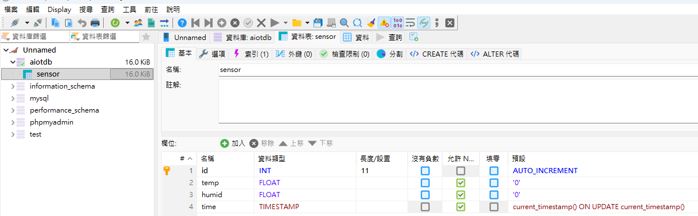
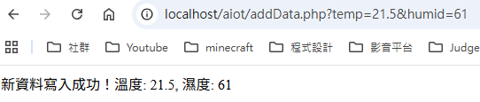
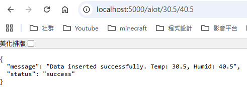

# AIoT 資料收集微服務專案報告

## 專案簡介
本專案為一個輕量級的物聯網 (IoT) 資料收集與儲存系統，主要目標是接收來自感測器端（如 ESP32 型微控制器處理的 DHT11 溫濕度感測器）的環境數據，並將其安全地格式化儲存至關聯式資料庫中。

本系統實作了兩種不同語言（PHP 與 Python）的資料寫入介面 API，讓硬體端能根據網路與運行環境的受限狀況，彈性選擇最合適的方式寫入雲端。

---

## 核心組件說明

### 1. `aiotdb` 資料庫
負責持久化儲存 (Persistent Storage) 溫濕度感測器的歷史紀錄。
內部包含 `sensor` 資料表，具備以下基礎結構：
*   **`id`**: 每筆紀錄的唯一識別碼 (Primary Key)，具備 Auto Increment 特性。
*   **`temp`**: 儲存環境溫度 (Floating point)。
*   **`humid`**: 儲存環境濕度 (Floating point)。
*   **`time`**: 資料寫入時的伺服器時間戳，具有自動更新並賦予預設當下時間 (`current_timestamp()`) 的屬性。

**圖 1：`aiotdb` 資料庫及 `sensor` 資料表結構**



### 2. `addData.php` (PHP 實作 API)
此為部署在 Apache 伺服器 (預設 Port 80) 上的輕量資料接收端點。
*   **功能描述**: 透過解析 HTTP GET 請求的 URL 參數來獲取溫濕度數值。
*   **通訊協定與路由**: 
    ```text
    GET http://localhost/addData.php?temp={溫度}&humid={濕度}
    ```
*   **安全機制**: 收到外部傳入的參數後，會由 `floatval()` 強制轉換為浮點數型態才進入 SQL 語句，以此防範基本的 SQL Injection 攻擊。

**圖 2：`addData.php` 成功接收與寫入資料結果**


### 3. `addData.py` (Python / Flask 實作 API)
此為使用 Python Flask 微框架建構的 REST-like 架構介面，獨立運行於 Port 5000。
*   **功能描述**: 利用 Flask 動態路由特性 (URL Path Parameters) 直接將溫濕度包含在 URL 路徑中，而非 Query String。
*   **通訊協定與路由**:
    ```text
    GET http://localhost:5000/aiot/{溫度}/{濕度}
    ```
*   **安全機制**: 與 PHP 版類似，會對傳入參數做 `float()` 轉換，並且在連接資料庫時採用了 **參數化查詢 (Parameterized Quey, `%s`)**，這是防範 SQL Injection 最有效、最標準的實務做法。此外，API 會回傳標準的 JSON 格式及相對應的 HTTP 狀態碼 (200, 400, 500) 代表狀態與錯訊。

**圖 3：`addData.py` Flask API 成功接收與寫入資料結果**


---

## 系統總結與應用場景
在此架構下，邊緣感測設備 (Edge Devices) 完全不需要了解資料庫的操作細節，僅需具備基礎發送 HTTP GET 的能力即可完成資料拋轉。

兩種 API 實作展示了不同後端技術的風格：
*   **PHP** 展現其與 Web Server (Apache) 深度整合，隨插即用、輕巧且容易佈署的特性。
*   **Python Flask** 則示範了現代 Web API 開發中針對路由管理清晰、JSON 結構化回應、以及預防資安風險的最佳實踐。

**圖 4：資料庫端成功寫入並儲存之資料列表**


